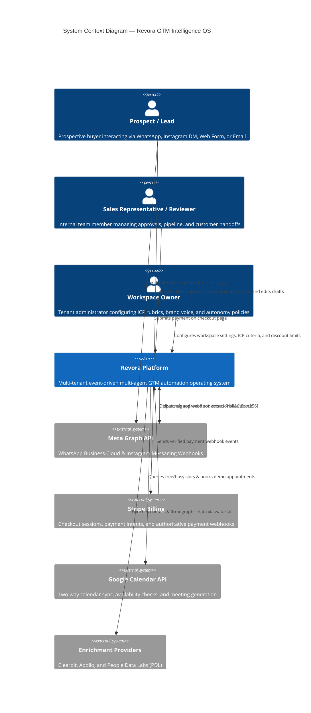
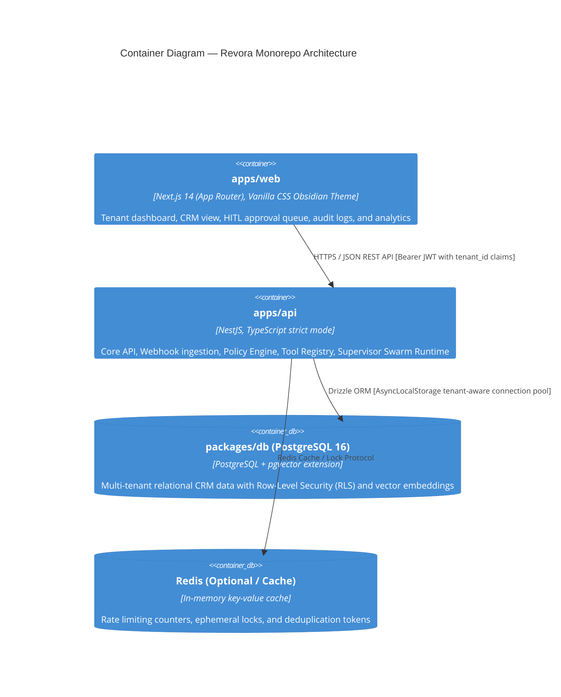
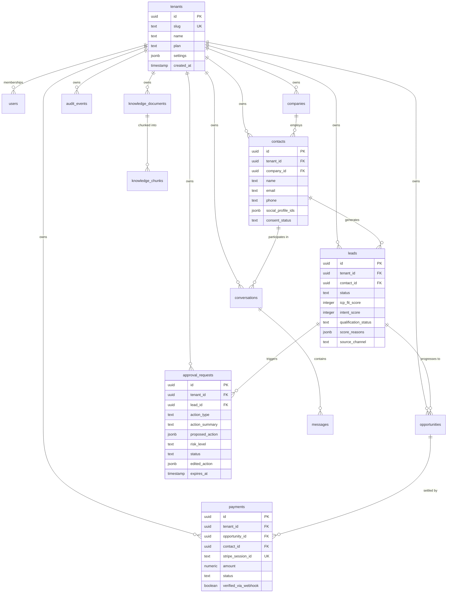
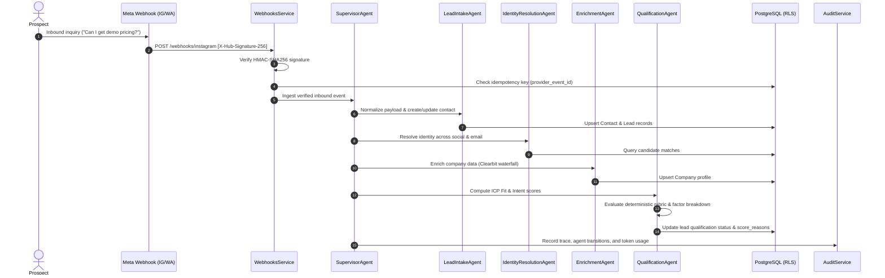
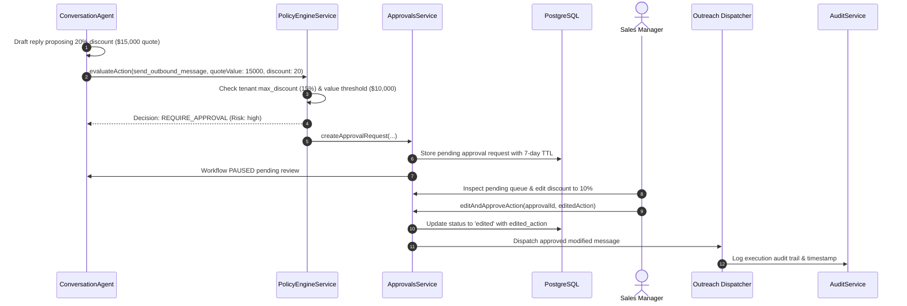
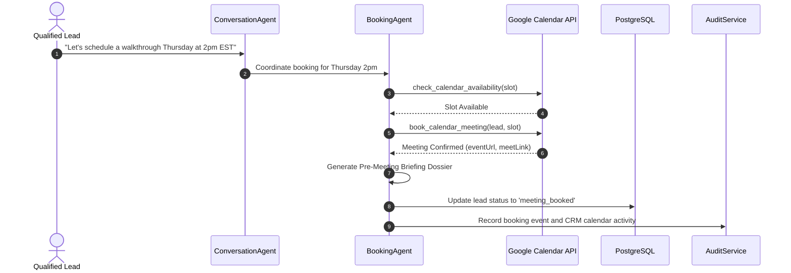
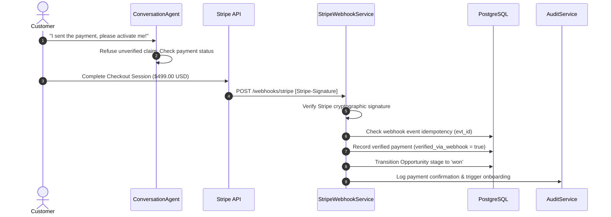

# Revora — Architecture Specification

Revora is a multi-tenant, event-driven, multi-agent GTM (Go-to-Market) and CRM automation platform. It orchestrates specialized AI agents across inbound lead capture, identity resolution, waterfall enrichment, explainable ICP scoring, conversational qualification, meeting scheduling, Stripe billing, and CRM synchronization under strict bounded autonomy.

```
+-----------------------------------------------------------------------------------+
|                               Revora GTM Intelligence OS                           |
|                                                                                   |
|  +--------------------+    +--------------------+    +-------------------------+  |
|  |   Omnichannel      |    |   Multi-Agent      |    |   Tenant Data Layer     |  |
|  |   Ingestion        |--->|   Swarm Runtime    |--->|   PostgreSQL + RLS      |  |
|  | WhatsApp/IG/Form   |    | Supervisor Routing |    |   pgvector Embeddings   |  |
|  +--------------------+    +--------------------+    +-------------------------+  |
|           |                          |                            |               |
|           v                          v                            v               |
|  +--------------------+    +--------------------+    +-------------------------+  |
|  | HMAC & Idempotency |    | Policy Engine &    |    | Immutable Audit Trail   |  |
|  | Webhook Invariant  |    | Human-in-the-Loop  |    | & Cost Tracking ($)     |  |
|  +--------------------+    +--------------------+    +-------------------------+  |
+-----------------------------------------------------------------------------------+
```

---

## 1. System Context Diagram (C4 Level 1)



---

## 2. Container Diagram (C4 Level 2)



---

## 3. Database ERD (Entity Relationship Diagram)



---

## 4. Sequence Diagrams

### 4.1 Lead Intake & Multi-Agent Swarm Pipeline



### 4.2 Human-in-the-Loop Approval & Message Dispatch



### 4.3 Meeting Booking Sequence



### 4.4 Stripe Authoritative Payment Sequence



---

## 5. Security & Isolation Models

### 5.1 Tenant Isolation
- **Row-Level Security (RLS)**: Every tenant-scoped table features PostgreSQL RLS policies (`WHERE tenant_id = current_setting('app.current_tenant_id')`).
- **AsyncLocalStorage (ALS)**: API request context binds the verified Clerk JWT `tenant_id` to the execution fiber. Client-provided `tenant_id` query parameters are strictly forbidden from overriding authenticated context.

### 5.2 Agent Permission Model
Agents are strictly bound by role-based tool permission tiers:
- **Tier 1 (Read-Only)**: `search_crm_contacts`, `search_knowledge_base`, `check_calendar_availability`. Allowed for autonomous execution.
- **Tier 2 (Internal Write)**: `update_lead_qualification`, `trigger_human_handoff`. Supervised execution.
- **Tier 3 (External Write)**: `draft_outbound_message`, `book_calendar_meeting`. Semi-autonomous under strict rate limits.
- **Tier 4 (Financial / High-Risk)**: `create_checkout_session`, outbound messages with discounts exceeding policy thresholds. Bounded autonomy: mandatory human approval required before execution.

---

## 6. Threat Model (STRIDE)

| Threat Category | Revora Threat Scenario | Platform Mitigation |
|---|---|---|
| **Spoofing** | Adversary attempts to forge webhook payloads | Strict HMAC-SHA256 signature verification on raw request buffers before deserialization. |
| **Tampering** | User manipulates client payload to change offer price | Authoritative server-side pricing catalog; client input price values are rejected. |
| **Repudiation** | Operator claims an unauthorized message was sent by AI | Immutable, tenant-isolated audit log recording actor, policy decisions, and full prompt traces. |
| **Information Disclosure** | Cross-tenant data leakage via search or vector queries | Multi-tenant PostgreSQL RLS combined with tenant-filtered pgvector cosine queries. |
| **Denial of Service** | Webhook flooding or LLM token exhaustion loops | Idempotency key deduplication in Redis/Postgres; hard tool execution iteration limits (max 5 turns). |
| **Elevation of Privilege** | Prompt injection attacks instructing agent to bypass approval | Untrusted input demarcation, system instructions forbidding instruction override, and server-side policy gatekeeper. |
